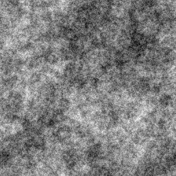
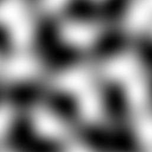
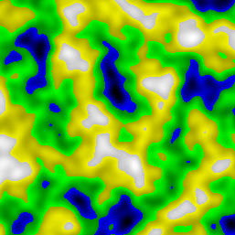
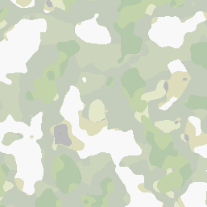

# agony-noise

I needed a sandbox for playing with some procedural generation techniques and to experiment with ways of structuring the code so it isn't a complete nightmare to work with.

This isn't meant to be a drop-in library for doing Fractal Brownian Motion. It's just a project for me to test stuff I might port into a real game later. It might also be useful if you are trying to implement FBM yourself and need an example to look at.

The [FastNoiseLite](https://github.com/Auburn/FastNoiseLite) classes are a huge time saver and are also MIT licensed. In the original project there are ports to C, C#, C++ and HLSL which I'm sure other folks could find useful.

I learned a lot of this by reading everything I could find on the subject, but in particular [Making Maps With Noise Functions](https://www.redblobgames.com/maps/terrain-from-noise/) was one of the most instructive and comprehensive articles I found.

## Compiling

```java
./gradlew clean build
```

## Running

```java
java -cp build/libs/agony-noise-0.2.0-SNAPSHOT.jar com.agonyengine.noise.Main
```

You should see a new PNG image appear in your project after a few seconds when it runs. If it's not what you wanted, tweak the parameters in the source and try again.

## Performance

The heavy lifting here is mostly done by FastNoiseLite, which has "fast" right there in the name. Here is the timing from generating the "Biome" example shown at the bottom of this file on my 2015 MBP with a decent amount of other stuff running in the background. That's about half a second to generate two 257x257 maps, 3 octaves each, re-scale them to the right ranges, assign colors and generate a PNG out of them. Seems reasonably fast to me, but you don't have to take my word for it.

```bash
time java -cp build/libs/agony-noise-0.2.0-SNAPSHOT.jar com.agonyengine.noise.Main
java -cp build/libs/agony-noise-0.2.0-SNAPSHOT.jar com.agonyengine.noise.Main  0.52s user 0.06s system 161% cpu 0.356 total
```

## Sample Images

I generated a few sample images to show a few of the things you can do with these noise generators.

Here is some Diamond Square noise using the generator that I implemented.



Here is a single layer of Open Simplex 2 noise from the FastNoiseLite library, using my framework.



Here is 3 octaves of Open Simplex 2 (FastNoiseLite) noise layered into Fractal Brownian Motion by the FbmNoise generator and given some color to highlight the elevations.



Here are two FBM maps used together to model elevation and moisture, and assigned colors for biomes based on [Amit Patel's interpretation](http://www-cs-students.stanford.edu/~amitp/game-programming/polygon-map-generation/) of a [Whittaker biome diagram](https://en.wikipedia.org/wiki/Biome). Look about half way down in Amit Patel's article for his table of biomes and their colors.

